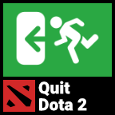
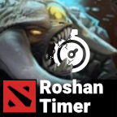
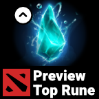
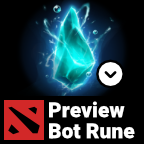

<h1 align="center">Stream Deck Plugins - Dota 2</h1>

  

A suite of Stream Deck plugins created for Valve's MOBA: Dota 2 ⚔️

# Actions
<h2 align="center">Toggle Game</h2>

  
  

Launch/Quit the 'Dota 2' application.

<h2 align="center">Roshan Timer</h2>

  

Keep track of Roshan's respawn time and item drops.

<h2 align="center">Show Top Rune</h2>

  

Quickly position the in-game camera to the top rune.

<h2 align="center">Show Bot Rune</h2>

  

Quickly position the in-game camera to the bottom rune.

# Downloads
- [Elgato Plugin Store (Recommended)](https://apps.elgato.com/plugins/com.adrian-miasik.sdpdota2)
- [Direct Download](StreamDeckPluginsDota2/distribute/com.adrian-miasik.sdpdota2.streamDeckPlugin)

# Installation
1. Install `com.adrian-miasik.sdpdota2.streamDeckPlugin` to your Stream Deck. 
    - Make sure to have the Elgato Stream Deck software installed. 
    - Simple double-clicking this file on Windows will prompt an install.
2. Add the following commands to your Dota 2 launch options: 
    - `-gamestateintegration +exec stream_deck_plugins_dota_2.cfg`

# Launch Options Explained
- The `-gamestateintegration` line is required to enable this plugin to read the contents of the Dota game state as of [2022 March 11th.](https://dota2.fandom.com/wiki/March_11,_2022_Patch)
- The `+exec stream_deck_plugins_dota_2.cfg` line is required to bind our cameras actions to certain function keys. Please ensure you have no keybindings on F13, F14, and F15.

# Actions Explained
- [Roshan Timer](https://github.com/adrian-miasik/stream-deck-plugins-dota-2/wiki/Roshan-Timer-Explained)

# Author Notes
- If you're looking to build this yourself, make sure to download [.NET Framework 4.7.2 Developer Pack](https://dotnet.microsoft.com/en-us/download/dotnet-framework/net472) and make sure to restore/update your NuGet packages as necessary.
- Distribution Pipeline:
  1. Build
  2. Navigate to the distribute folder
  3. Run the appropriate `.bat` script (Debug / Release). This will take our built solution and package the files using Elgato's Distribution Tool to create a plugin file. The output will create a `.streamDeckPlugin` file in the same directory.

If you have any questions, feel free to reach out. :)

- Playerbase: 831 installs on the Elgato Store
- The SVG assets have been created myself and/or sourced from The Noun Project

# Contact Us / Support Line
- For inquires related to this specific plugin / repository: `sdp-dota-2@adrian-miasik.com`
- For inquries related to any of my stream deck plugins: `stream-deck-plugins@adrian-miasik.com`

# Third Party
- Created with BarRaider's [streamdeck-tools](https://github.com/BarRaider/streamdeck-tools) SDK 👍
- Created with antonpup's [Dota 2 Game State Integration](https://github.com/antonpup/Dota2GSI) interface 👍
- Utilizes michaelnoonan's [inputsimulator](https://github.com/michaelnoonan/inputsimulator) package 👍

# Legal
Copyrights and trademarks are the property of their respective owners.
- Adrian Miasik (Logo)
- Dota 2 (Logo)
- Roshan Spell Block (Skill Art)
- Aegis of the Immortal (Item Art)
- Cheese (Item Art)
- Aghanim's Shard (Item Art)
- Aghanim's Blessing (Item Art)
- Refresher Shard (Item Art)
- Water Rune (Gameplay Update Art)
