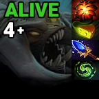

<h1 align="center">Stream Deck Plugins - Dota 2</h1>

  

A suite of Stream Deck plugins created for Valve's MOBA: Dota 2 ⚔️

# Actions
<h2 align="center">Roshan Timer</h2>

  

Keep track of Roshan's respawn time and item drops.

<h2 align="center">Show Top Rune</h2>

  

Quickly position the in-game camera to the top rune.

<h2 align="center">Show Bot Rune</h2>

  

Quickly position the in-game camera to the bottom rune.

<h2 align="center">Quit Application</h2>

  

Quit the Dota 2 application.

# Downloads
- [Elgato Plugin Store (Recommended)](https://apps.elgato.com/plugins/com.adrian-miasik.sdpdota2)
- [Direct Download](StreamDeckPluginsDota2/distribute/com.adrian-miasik.sdpdota2.streamDeckPlugin)

# Installation
1. Install `com.adrian-miasik.sdpdota2.streamDeckPlugin` to your Stream Deck. 
    - Make sure to have the Elgato Stream Deck software installed. 
    - Simple double-clicking this file on Windows will prompt an install.
2. Add the following commands to your Dota 2 launch options: 
    - `-gamestateintegration +exec stream_deck_plugins_dota_2.cfg`

**Important:** Make sure you have nothing currently bound to F13, F14, and F15. If you do, please edit the `stream_deck_plugins_dota_2.cfg` to use unassigned keys.

# Launch Options Explained
- The `-gamestateintegration` line is required to enable this plugin to read the contents of the Dota game state as of [2022 March 11th.](https://dota2.fandom.com/wiki/March_11,_2022_Patch)
- The `+exec stream_deck_plugins_dota_2.cfg` line is required to bind our cameras actions to certain function keys. Please ensure you have no keybindings on F13, F14, and F15.

# Actions Explained
<h2 align="center">Roshan Timer</h2>

  

 Keep track of Roshan's respawn time and item drops.

### How to Use
| Action       | Result                                                      |
|--------------|-------------------------------------------------------------|
| Single Press | Start / Pause / Resume timer                                |
| Long Press   | Restart timer                                               |
| Double Press | Increase Roshan death count (Do this everytime Roshan dies) |

### Timer States

#### Default
> - Timer has not been started. **Press on Roshan's first death to begin the timer.**

---

#### Dead
> - **Dead** when the timer is less than 8 minutes.

- First Death
- Roshan has previously dropped: `Aegis of the Immortal`
 

- Second Death
- Roshan has previously dropped: `Aegis of the Immortal` + `Aghanims Shard` 
 

- Third Death
- Roshan has previously dropped: `Aegis of the Immortal` + `Cheese` + (`Refresher Shard` OR `Aghanims Blessing`)
 

- Fourth Death
- Roshan has previously dropped: `Aegis of the Immortal` + `Cheese` + `Aghanims Blessing` + `Refresher Shard`

---

#### Maybe & Alive
> - **Maybe** when the timer is between 8-11 minutes.
> - **Alive** when the timer is 11 minutes or more.

- First Death
- Roshan is going to drop: `Aegis of the Immortal` + `Aghanims Shard`
   

- Second Death
- Roshan is going to drop: `Aegis of the Immortal` + `Cheese` + (`Refresher Shard` OR `Aghanims Blessing`)
   

- Third Death
- Roshan is going to drop: `Aegis of the Immortal` + `Cheese` + `Aghanims Blessing` + `Refresher Shard`
   

- Fourth Death
- Roshan is going to drop: `Aegis of the Immortal` + `Cheese` + `Aghanims Blessing` + `Refresher Shard`

# Author Notes
- If you're looking to build this yourself, make sure to download [.NET Framework 4.7.2 Developer Pack](https://dotnet.microsoft.com/en-us/download/dotnet-framework/net472) and make sure to restore/update your NuGet packages as necessary.
- Distribution Pipeline:
  1. Build
  2. Navigate to the distribute folder
  3. Run the appropriate `.bat` script (Debug / Release). This will take our built solution and package the files using Elgato's Distribution Tool to create a plugin file. The output will create a `.streamDeckPlugin` file in the same directory.

If you have any questions, feel free to reach out. :)

# Contact Us / Support Line
- For inquires related to this specific plugin / repository: `sdp-dota-2@adrian-miasik.com`
- For inquries related to any of my stream deck plugins: `stream-deck-plugins@adrian-miasik.com`

# Third Party
- Created with BarRaider's [streamdeck-tools](https://github.com/BarRaider/streamdeck-tools) SDK 👍

# Legal
Copyrights and trademarks are the property of their respective owners.
- Adrian Miasik (Logo)
- Dota 2 (Logo)
- Roshan Spell Block (Skill Art)
- Aegis of the Immortal (Item Art)
- Cheese (Item Art)
- Aghanim's Shard (Item Art)
- Aghanim's Blessing (Item Art)
- Refresher Shard (Item Art)
- Water Rune (Gameplay Update Art)
